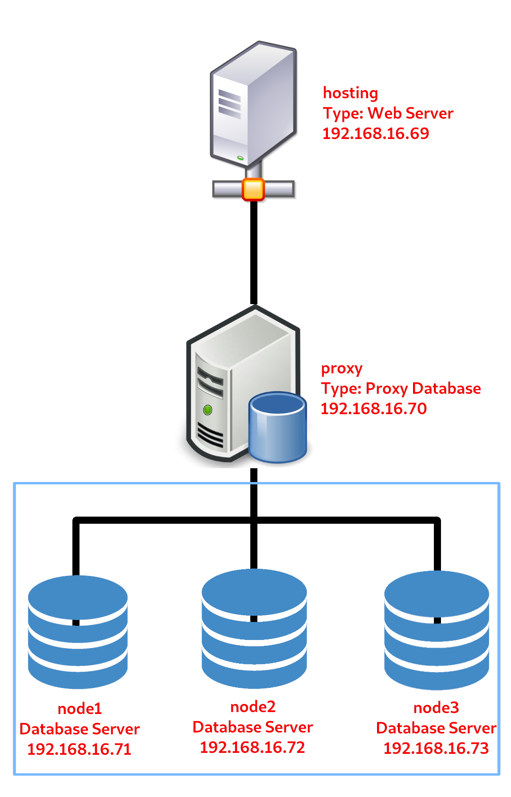

# Mid Semester Evaluation

Name: Deddy Aditya Pramana  
NRP: 05111640000069

## Structure

The plan is to apply Moodle E-learning Framework to a clustered database system with proxy. The system will have one web server (hosting), one proxy database server (proxy), and 3 database servers as node. This system will be implemented using Vagrant with Virtualbox. The following section will explain how the system architechture and specification.

The vagrant file and provisioning scripts will be added later on `main` folder.

### Diagram

### Specification

#### 1. Web Server

**Hardware Specification**

- **CPU**: Single Core CPU
- **Memory**: 512 MB
- **Virtualization Engine**: Virtualbox 6

**Software Specification**

- **OS**: Debian 10 Buster
- **Web Server**: 1.14.2
- **Fast CGI Processor**: PHP 7.3

**Network Specification**

- **Hostname**: hosting
- **Type**: Host-only Network
- **IP**: 192.168.16.69

#### 2. Database Proxy Server (Load Balancer)

**Hardware Specification**

- **CPU**: Single Core CPU
- **Memory**: 512 MB
- **Virtualization Engine**: Virtualbox 6

**Software Specification**

- **OS**: Debian 10 Buster
- **Database Proxy**: ProxySQL 2.0.7

**Network Specification**

- **Hostname**: proxy 
- **Type**: Host-only Network
- **IP**: 192.168.16.70

#### 3. Database Server #1

**Hardware Specification**

- **CPU**: Single Core CPU
- **Memory**: 512 MB
- **Virtualization Engine**: Virtualbox 6

**Software Specification**

- **OS**: Debian 10 Buster
- **RDBMS**: Percona Server 8.0.16
- **Clustering**: Percona XtraDB Cluster 5.7.27-31.39

**Network Specification**

- **Hostname**: node1
- **Type**: Host-only Network
- **IP**: 192.168.16.71

#### 4. Database Server #2

**Hardware Specification**

- **CPU**: Single Core CPU
- **Memory**: 512 MB
- **Virtualization Engine**: Virtualbox 6

**Software Specification**

- **OS**: Debian 10 Buster
- **RDBMS**: Percona Server 8.0.16
- **Clustering**: Percona XtraDB Cluster 5.7.27-31.39

**Network Specification**

- **Hostname**: node2
- **Type**: Host-only Network
- **IP**: 192.168.16.73

#### 5. Database Server #3

**Hardware Specification**

- **CPU**: Single Core CPU
- **Memory**: 512 MB
- **Virtualization Engine**: Virtualbox 6

**Software Specification**

- **OS**: Debian 10 Buster
- **RDBMS**: Percona Server 8.0.16
- **Clustering**: Percona XtraDB Cluster 5.7.27-31.39

**Network Specification**

- **Hostname**: node3
- **Type**: Host-only Network
- **IP**: 192.168.16.73
